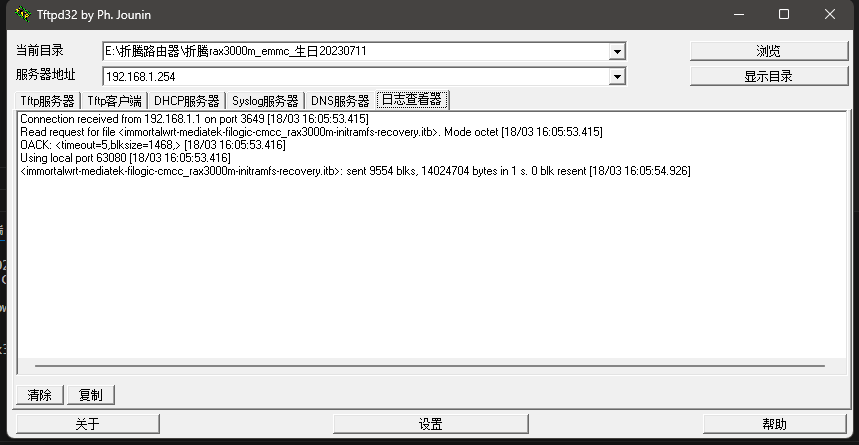

### 解锁SSH(配置文件未加密)
从路由器中导出配置文件: cfg_export_config_file.conf 使用7z打开修改

    1,编辑“etc/config/dropbear”，将“enable”设置为“1”。
    2,编辑“etc/shadow”，删除root密码,变成这样：
      root::19523:0:99999:7:::
上传到路由器后即可开启ssh登录

### 刷入uboot
 使用winscp上传二进制文件

    rax3000m-emmc-bl31-uboot.fip
    rax3000m-emmc-gpt.bin
    rax3000m-emmc-preloader.bin

#### 写入新的GPT表：

    dd if=/tmp/rax3000m-emmc-gpt.bin of=/dev/mmcblk0 bs=512 seek=0 count=34 conv=fsync

#### 擦除并写入新的BL2：

    echo 0 > /sys/block/mmcblk0boot0/force_ro
    dd if=/dev/zero of=/dev/mmcblk0boot0 bs=512 count=8192 conv=fsync
    dd if=/tmp/rax3000m-emmc-preloader.bin of=/dev/mmcblk0boot0 bs=512 conv=fsync

#### 擦除并写入新的FIP：

    dd if=/dev/zero of=/dev/mmcblk0 bs=512 seek=13312 count=8192 conv=fsync
    dd if=/tmp/rax3000m-emmc-bl31-uboot.fip of=/dev/mmcblk0 bs=512 seek=13312 conv=fsync

### 刷写启动包
 将windows系统网卡ip改为192.168.1.254
    immortalwrt-mediatek-filogic-cmcc_rax3000m-initramfs-recovery.itb

    启动tftp后会发现这个日志,即完事了.

###刷最新系统

最后进入192.168.1.1 op系统刷写包

    immortalwrt-24.10.5-mediatek-filogic-cmcc_rax3000m-squashfs-sysupgrade.itb
